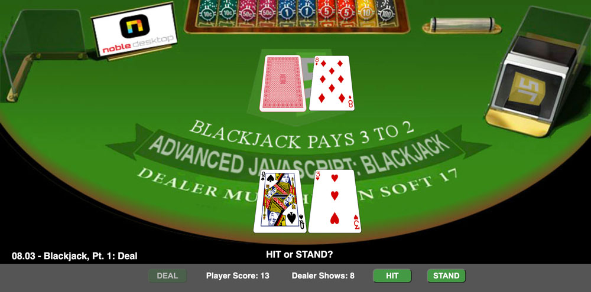

<!-- # Lesson 08.03  -->

<p align="center">

</p>

<br>

<p align="center">

</p>

<br>

### Blackjack - Pt. 1: DEAL..!
### Review of Lesson 05.04: Making a deck of cards with a nested loop
### New for Lesson 08.03: Deal Blackjack on a timer with setInterval
### Keep score and display the score to the DOM
### Detect Blackjack (21) for the Player, the Dealer -- or both
### Prompt Player to Hit or Stand

Review the code for making a deck of cards as an array of card objects:

1. Given: Arrays of **kinds** and **suits**. These are the "raw materials" for making a deck of cards:

```
    const kinds = [2, 3, 4, 5, 6, 7, 8, 9, 10, 'Jack', 'Queen', 'King', 'Ace'];
    const suits = ['Diamonds', 'Hearts', 'Spades', 'Clubs'];
    const deck = [];
```

2. Review: Set up a nested for loop that iterates over the **kinds** and **suits** arrays:

```
    for (let i = 0; i < kinds.length; i++) {
        for (let j = 0; j < suits.length; j++) {
```

3. Review: Simplify the current array items by passing them to variables:

```
            let kind = kinds[i];
            let suit = suits[j];
```

4.  Review: Concatenate the card name and image file names. The card "Queen of Diamonds" corresponds to the file name "Queen-of-Diamonds.png"

```  
            let name = `${kind} of ${suit}`;
            let file = `${kind}-of-${suit}.png`;
```
            
5.  Review: Declare a variable, **valu**, with an inital value of 0. This variable is for storing the numeric value of the card:
            
```
            let valu = 0;
```
            
6.  Review: Set the **valu** property, based on the **kind** of card. The **length** of the **kind** reveals if it is a face card, since only "Jack", "Queen", "King" are longer than three characters:

```
            if(kind.length > 3)  {
                valu = 10;
            } else if(kind == 'Ace') {
                valu = 11;
            } else {
                valu = kind;
            }
```

Review: Each card is an object having five properties:
- **name**: the name of the card: "Jack of Hearts"
- **file**: the card file name: "Jack-of-Hearts.png"
- **kind**: 2-10, 'Jack', 'Queen', 'King', 'Ace'
- **suit**: 'Diamonds', 'Hearts', 'Spades', 'Clubs'
- **valu**: numeric value; face card = 10, Ace = 11

7.  Review: Declare a card object with the five properties, the values of which are the corresponding variables: 

```
            let card = { name: name, file: file, kind: kind, 
                         suit: suit, valu: valu };
```

8.  Review: Push the card object into the deck array:

```
            deck.push(card);
        }
    }
```

9. Review: Shuffle (randomize) the deck:

```
    deck.sort((a,b) => {
        return Math.random() - 0.5;
    });
    console.log('shuffled deck:', deck);
```

10. Review: Make a shoe consisting of 6 decks of cards, using the spread ... operator:

```
    const shoe = [...deck, ...deck, ...deck, ...deck, ...deck, ...deck];
```

11. Review: Shuffle (randomize) the shoe:

```
    shoe.sort((a,b) => {
        return Math.random() - 0.5;
    });
    console.log('shuffled shoe:', shoe);
```

12. Get the DOM elements:  
- get the **DEAL** button and assign it an event listener for calling the **deal** function when clicked
- get the **HIT** and **STAND** buttons (they will not be assigned listeners yet)
- get the **h2**, which is for outputting prompts ("HIT or STAND?", etc.)

```
    const dealBtn = document.getElementById('deal-btn');
    dealBtn.addEventListener('click', deal);
    const hitBtn = document.getElementById('hit-btn');
    const standBtn = document.getElementById('stand-btn');
    const outputH2 = document.querySelector('h2');
```

13. Get the divs that hold the player and dealer hands, as well as those divs which display the player and dealer scores:

```
    const playerCardsDiv = document.getElementById('player-cards-div');
    const dealerCardsDiv = document.getElementById('dealer-cards-div');
    const playerScoreDiv = document.getElementById('player-score-div');
    const dealerScoreDiv = document.getElementById('dealer-score-div');
```

14. Declare global variables needed for keeping track of the deal:
- arrays for holding the player's and dealer's hands 
- variables for keeping score
- **dealCounter** for keeping track of total cards dealt

```
    let dealCounter = 0;
    let playerHand = [];
    let dealerHand = [];
    let playerScore = 0;
    let dealerScore = 0;
```

**Dealing Blackjack**  
Now that we have our six-deck shoe, all shuffled and ready to go, let's deal a hand of Blackjack. We dealt a hand of poker in an earlier lesson, but this will be different. To better simulate game play, we will use **setInterval** to deal on a 1 second delay between cards. 
- the deal consists of player and dealer hands, each of which receives two cards to start. 
- the dealer's first card -- the "hole card" -- is dealt face down, so that the player only gets to see one of the dealer's cards to start.

15. Define the deal function:

```
    function deal() {
```

16. Since this is a new hand, reset the scores and "clear the table"
- reset the counter variable that keeps track of cards dealt
- reset the player and dealer scores
- empty the divs that display the cards
- clear the text from the output h2
- empty the arrays that store the player and dealer hands

```
        dealCounter = 0;
        playerScore = 0;
        dealerScore = 0;
        playerScoreDiv.innerHTML = 'Player Score: 0';
        dealerScoreDiv.innerHTML = 'Dealer Shows: 0';  
        playerCardsDiv.innerHTML = '';
        dealerCardsDiv.innerHTML = '';
        outputH2.innerHTML = "";
        playerHand = [];
        dealerHand = []; 
```

17. Call the **setInterval** method, with its callback function set equal to a variable, **myInterval**, which will be used to clear the interval (stop deal):

```
    let myInterval = setInterval(() => {
```

18. Increment the counter that keeps track of how many card have been dealt

```
        dealCounter++;
```

19. If this is the 4th card being dealt, make this the last card by clearing the interval, which stops the setInterval timer from running again.

```
        if(dealCounter == 4) clearInterval(myInterval);
```

20. Instantiate a new **Image** object to hold the card image:

```
        let pic = new Image();
```

21. Pop a card object off the **shoe** array, and save it as a new **card**:

```
        let card = shoe.pop();
```

22. If this is not the hole card (which is the second card dealt overall), set the image source to the card image file path, ending in the **card.file** property:

```
        if(dealCounter != 2) {
            pic.src = `images/cards350px/${card.file}`; 
```

23. **else**, if this *is* the "hole card", deal it face-down by setting its source to the back-of-card image:

```
        } else {
            pic.src = 'images/cards350px/0-Back-of-Card-Red.png'; 
        }
```

24. Set up an if-else statement to handle the logic for dealing two cards each to the player and dealer, starting with the player.  
- the if condition uses the **% mod** operator to check the remainder when the counter is divided by 2  
- if the remainder is 1, this is either the first or third card, both of which go to the player:

```
        if(dealCounter % 2 == 1) {
```

25. Output the card to the player's div:

```
            playerCardsDiv.appendChild(pic);
```

26. Push the card into the player's hand:

```
            playerHand.push(card);
```

27. Increment the player's score:

```
            playerScore += card.valu;
            playerScoreDiv.innerHTML = "Player Score: " + playerScore;
```
            
28. Add the else part to handle the two cards which are dealt to the dealer:

```        
        } else { 
```

29. Make the dealer cards a bit smaller to make them appear farther away:

```
            pic.style.width = "105px";
            pic.style.height = "auto";
```

30. Output the card to the dealer's div:

```
            dealerCardsDiv.appendChild(pic);
```
            
31. Push the card into the dealer's hand:

```
            dealerHand.push(card);
```
            
32. Update the dealer's score:

```
            dealerScore += card.valu;  
         }
```

33. Update **Dealer Shows** once the deal ends. This is not the dealer's score, but rather the value of the dealer's second card--the "non-hole card":

```
        if(dealerHand.length == 2) {
            dealerScoreDiv.innerHTML = "Dealer Shows: " + dealerHand[1].valu;
```
            
34. Log the dealer's full hand and secret score to the console:

```
            console.log('dealer hand: ', dealerHand, 'dealer score: ', dealerScore);
```
            
35. If no one has blackjack, deactivate the DEAL button so that it cannot be clicked again:

```          
            if(dealerScore != 21 && playerScore != 21) {
                dealBtn.disabled = true;
```

36. Also mute the color of the DEAL button so that it looks unclickable:

```
                dealBtn.classList.add('disabled-btn');
```
                
37. Un-mute the HIT and STAND buttons and set their **disabled** property to **false**. The button appearance is handled by removing and adding classes:

```
                hitBtn.disabled = false;
                standBtn.disabled = false;
            }
```

38. Prompt the player to "HIT or STAND?". For better game play pacing, do the prompt on a 1.5 second delay with **setTimeout**:

```
            setTimeout(() => {
                if(playerScore != 21) {
                    outputH2.innerHTML = "HIT or STAND?";
                    hitBtn.classList.remove('disabled-btn');
                    standBtn.classList.remove('disabled-btn');
                    hitBtn.classList.add('enabled-btn');
                    standBtn.classList.add('enabled-btn');
                }
            }, 1500);
        }
```

39. Check to see if either the player or dealer (or both, or neither) have Blackjack, and make the correct announcement on a 1 second delay. If neither has Blackjack, prompt the player to "HIT or STAND":

```
            setTimeout(() => {
                if(playerScore == 21 && dealerScore == 21) {
                    outputH2.innerHTML = 'Dealer and Player both have Blackjack!<br>It's a Push!';
                } else if(playerScore == 21) {
                    outputH2.innerHTML = 'BLACKJACK! You win!';
                } else if(dealerScore == 21) {
                    outputH2.innerHTML = 'Dealer has BLACKJACK! You lose!';
                } else { // no one has Blackjack
                    outputH2.innerHTML = "HIT or STAND?";
                }
            }, 1000);
```

40. Set the **setInterval** timer to **1000**, so that cards are dealt at 1 second intervals:

```
        }, 1000);

    } // end deal() function
```

41. Run the game in the browser and click **DEAL** to make sure the cards are being dealt properly and that the scoring is correct. 

42. Also check the console to make sure that the dealer hand and full score are appearing.  

**END: Lesson 08.03**  
**NEXT: Lesson 08.04**  